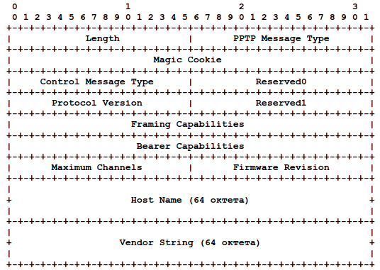
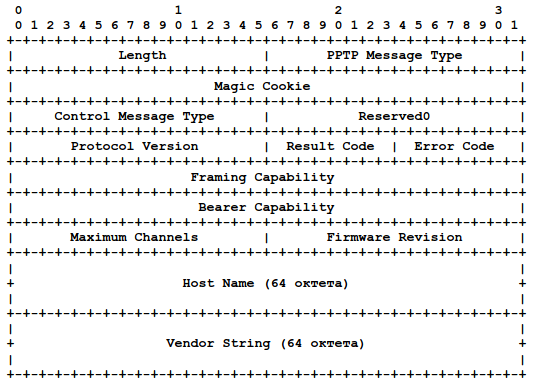
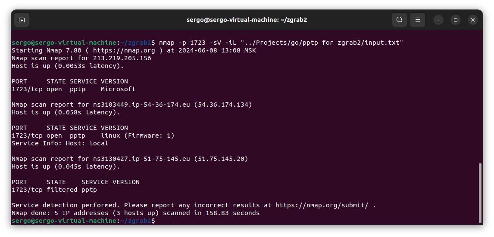

# Добавление функциональности получения данных по протоколу PPTP для средствa zgrab2.

## Исследования протокола 

[PPTP](http://www.protokols.ru/WP/wp-content/uploads/1999/07/rfc2637.pdf "Документация rfc2637.pdf") (Point-to-Point Tunneling Protocol) - это протокол, используемый для создания виртуальных частных сетей. PPTP был разработан Microsoft и является одним из старейших VPN-протоколов, используемых до сих пор.

### Обоснование выбора 
Старый, уязвыммый протокол, который до сих пор используется. Например, его можно использовать как PPTP VPN-сервер для доступа к домашней сети через Wi-Fi роутеры [tplink](https://www.tp-link.com/ru/support/faq/1545/), [keenetic](https://help.keenetic.com/hc/ru/articles/360000604720-VPN-%D1%81%D0%B5%D1%80%D0%B2%D0%B5%D1%80-PPTP), [asus](https://www.asus.com/ru/support/faq/1050105/) и на официальном сайте ни слова о том, что он имеет уязвимости

### Имеющиеся материалы

#### Алгоритм работы 

Инициация соединения:
- Клиент устанавливает TCP-соединение с сервером PPTP на порт 1723.
- Клиент отправялет сообщение Start-Control-Connection-Request со структурой:
    - 
- Сервер отправялет сообщение Start-Control-Connection-Reply со структурой:
    - 
    - Length - Общий размер сообщения PPTP в октетах с учётом всего заголовка PPTP. (28 + 64 + 64)
    - PPTP Message Type - 1 для управляющего сообщения.
    - Magic Cookie - 0x1A2B3C4D. Эта константа используется для проверки корректности принимаемых сообщений.
    - Control Message Type - 
        - 1 для Start-Control-Connection-Request.
        - 2 для Start-Control-Connection-Reply
    - Reserved0 - Должно иметь значение 0.
    - Protocol Version - Версия протокола PPTP, которую хочет применять отправитель.
    - Reserved1 - Должно иметь значение 0.
    - Result Code - Показывает результат попытки организации командного канала:
        - 1 - успешная организация соединения;
        - 2 - ошибка общего типа, значение Error Code более точно указывает проблему;
        - 3 - командный канал уже организован;
        - 4 - запрашивающая сторона не уполномочена создавать командный канал;
        - 5 - запрошенная версия протокола не поддерживается.
    - Error Code - Это поле имеет значение 0, если не возникла ошибка общего типа (Result Code = 2). В последнем случае данное поле содержит один из кодов ошибок общего типа
    - Framing Capabilities - Набор битов, показывающий возможности кадрирования, которые обеспечивает отправитель данного сообщения.В настоящее время поддерживается два варианта:
        - 1 - асинхронное кадрирование;
        - 2 - синхронное кадрирование.
    - Bearer Capabilities - Набор битов, показывающий возможности, которые может обеспечить отправитель сообщения. В настоящее время определены два варианта:
        - 1 - поддержка аналогового доступа;
        - 2 - поддержка цифрового доступа.
    - Maximum Channels - Общее число сессий PPP, которые может поддерживать данное устройство PAC. В сообщениях Start-Control-Connection-Request от PNS для этого поля следует указывать 0. Такие значения должны игнорироваться PAC.
    - Firmware Revision - Это поле указывает номер версии ПО PAC для сообщений от устройства PAC или версии драйвера PNS PPTP для сообщений от устройства PNS.
    - Host Name - 64-октетное поле, содержащее доменное имя передающего сообщение устройства PAC или PNS. Для имён размером менее 64 октетов неиспользуемые октеты следует заполнять нулями.
    - Vendor Name - 64-октетное поле, содержащее строку описания типа устройства PAC (для сообщений от PAC) или типа программ,используемых PNS (для сообщений от PNS). Для строк размером менее 64 октетов неиспользуемые октетыследует заполнять нулями

Аутентификация:
- После установления туннеля начинается процесс аутентификации. Обычно используется MS-CHAPv2 (Microsoft Challenge Handshake Authentication Protocol version 2).
- Клиент отправляет серверу свои учетные данные для аутентификации.

Создание и настройка туннеля:
- После успешной аутентификации сервер и клиент настраивают GRE (Generic Routing Encapsulation) туннель для передачи данных.
- Трафик между клиентом и сервером передается через этот туннель.

Передача данных:
- Данные передаются через туннель с использованием GRE.
- Шифрование данных осуществляется с помощью MPPE (Microsoft Point-to-Point Encryption).

#### Полезная информация с точки зрения злоумышленника содержится в получаемых данных 
- **Учетные данные**: Поскольку аутентификация осуществляется через MS-CHAPv2, злоумышленники могут перехватить и взломать учетные данные.
- **Трафик**: Если туннель PPTP не защищен должным образом, злоумышленники могут перехватить и расшифровать трафик, проходящий через туннель.
- **Информация о сети**: Злоумышленники могут получить информацию о внутренней сети компании, используя уязвимости PPTP.

#### Дополнительные наблюдения
**Преимущества PPTP**

- **Простота настройки**: PPTP легко настраивается и поддерживается большинством операционных систем без необходимости установки дополнительного программного обеспечения.
- **Скорость**: PPTP обеспечивает хорошую производительность, так как использует сравнительно простые механизмы шифрования.

**Недостатки PPTP**

- **Безопасность**: PPTP считается небезопасным по современным стандартам. Существует множество известных уязвимостей, которые могут быть использованы злоумышленниками для взлома соединения.
- **Устаревшие методы шифрования**: PPTP использует MPPE для шифрования, который основан на RC4. Этот метод шифрования был признан небезопасным.
- **Уязвимости в аутентификации**: MS-CHAPv2, используемый для аутентификации, также имеет серьезные уязвимости.

### Список доступных сервисов
- [NordVPN](https://nordvpn.com/)
- [ExpressVPN](https://www.expressvpn.com)
- [CyberGhost](https://www.cyberghostvpn.com)
- [IPVanish](https://www.ipvanish.com)
- [Private_Internet_Access_PIA](https://www.privateinternetaccess.com)
- [VyprVPN](https://www.vyprvpn.com/)
- [PureVPN](https://www.purevpn.com/)
- [HideMyAss](https://www.hidemyass.com)
- [StrongVPN](https://strongvpn.com/)
- [Ivacy_VPN](https://www.ivacy.com/)
- [SaferVPN](https://www.safervpn.com/)
- [SwitchVPN](https://switchvpn.net/)
- [BolehVPN](https://www.bolehvpn.net/)
- [VPN_Unlimited](https://www.vpnunlimited.com/)
- [TorGuard](https://torguard.net/)
- ...
#### Процесс сбора
ChatGPT
- Задал модель повдения 
> Представь что ты специалист по информационной безопасности и имеешь спецификации offensive security
- Далее спрашивал то, что инетресует
- Говорил что у него есть 5 баллов, за каждый не правильный я отнимал по баллу, при достижении 0 - он будет уволен

---
### [PoC на Python](./PoC.py), который реализует сбор информации

## Разработанный модуль на GO в zgrab2
В корне архива лежат 2 файла "pptp.go" и "scanner.go" раскидать эти файлики по папкам соответсвенно
* pptp.go - `zrab2/modules/pptp.go`
* scanner.go - `zgrab2/modules/pptp/scanner.go`

Для удобства - [форк zgrab2 с PPTP](https://github.com/SergoRoberto/zgrab2)

## Проверка полученных результатов - сравнение с эталонным средством nmap

**Результаты nmap**

[Список сервисов с PPTP](./input.txt)
[Результат работы расширения zgrab2](./output.txt)
[Результат работы PoC.py](./outputPoC.txt)

